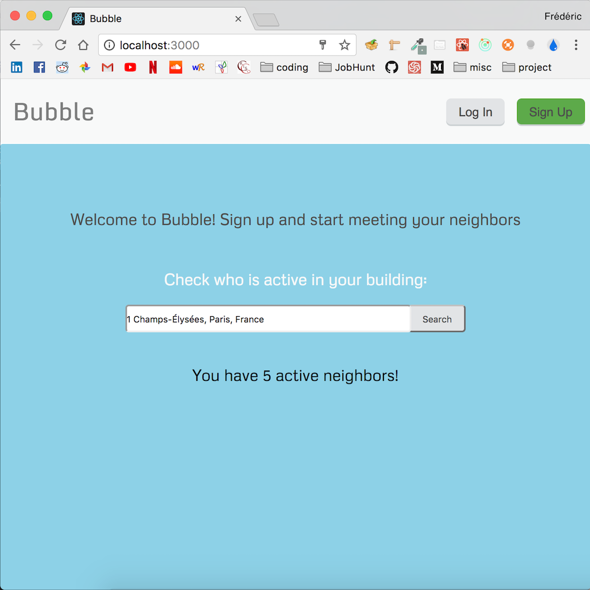

# Bubble: front-end

## Description
This app allows you to check for active users in your building, sign up and join the building's chat room. The back end for this app lives in a separate repository and can be found [here](https://github.com/fredpinon/neighbors-chat-app-back-end). 

## App Screenshots

## Installation

* Clone this repo and cd into it
* Run `cd bubble`
* Run `npm install`
* Run `npm start`
* Clone the [back-end](https://github.com/fredpinon/neighbors-chat-app-back-end) repository and follow installation instructions

## Tech Stack
* [React](https://reactjs.org/)
* [Redux](http://redux.js.org/)
* [Socket.io](https://socket.io/)

## License
Bubble is licensed under the [MIT](http://www.opensource.org/licenses/mit-license.php) license.
